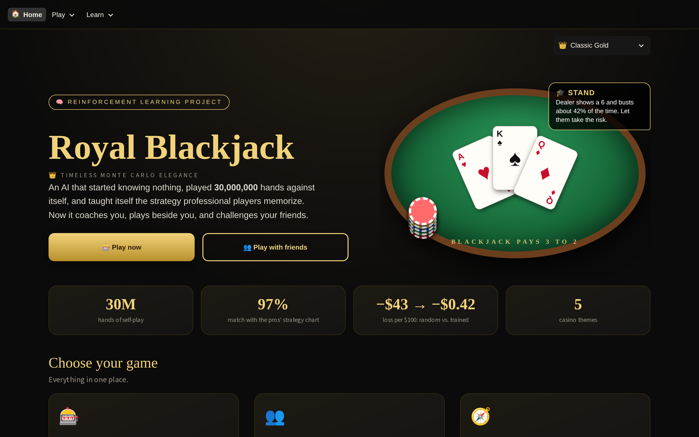
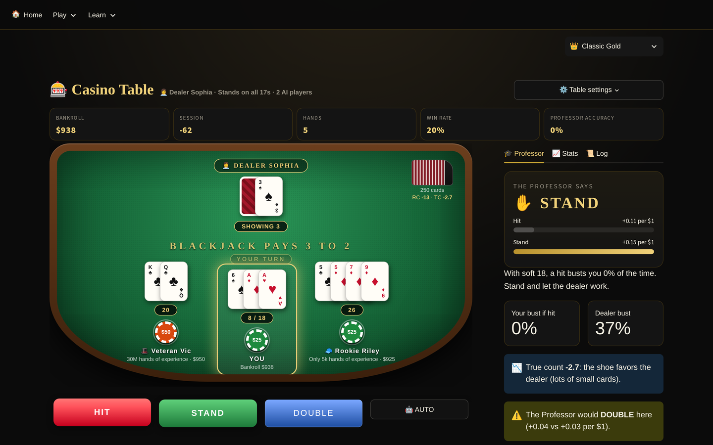
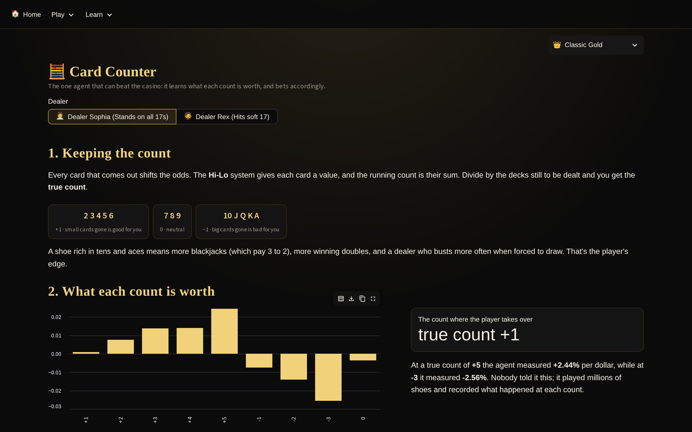
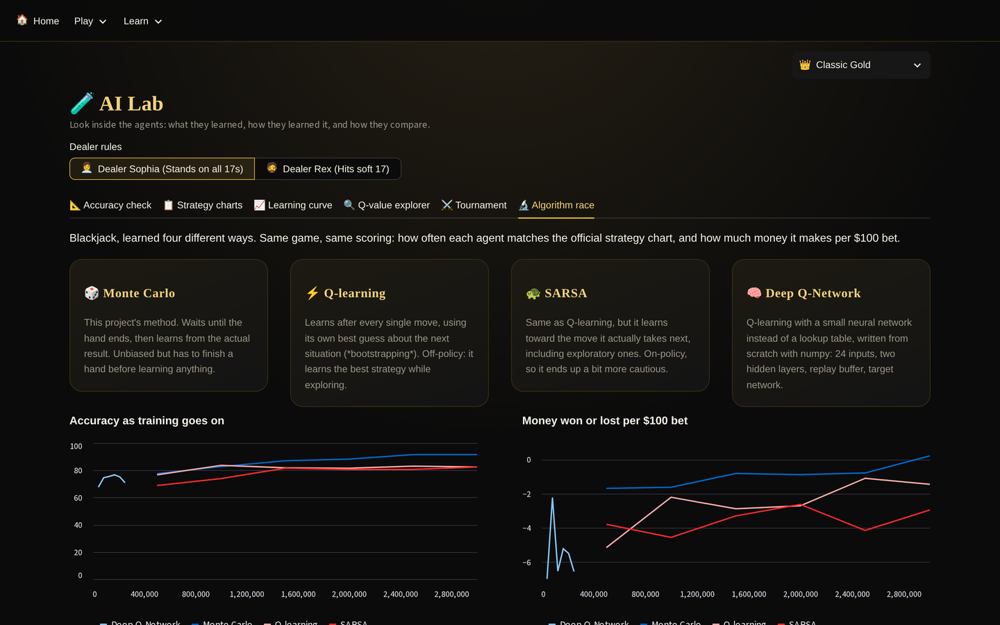
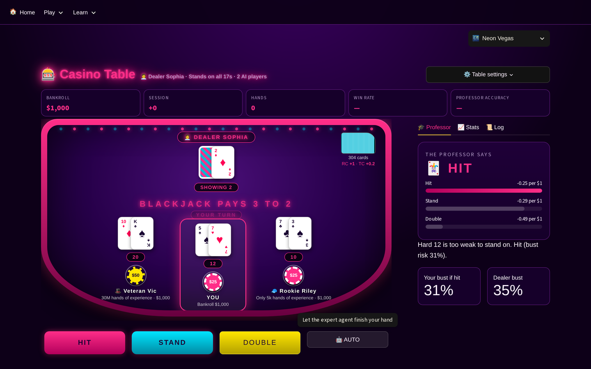

# ♠ Royal Blackjack ♥
### A casino that taught itself to play: reinforcement learning in action

Royal Blackjack is a full casino Blackjack game built with **Streamlit**, powered by AI agents that learned
to play entirely on their own through **Monte Carlo reinforcement learning**. No strategy was programmed in:
the agents started knowing nothing, played hundreds of thousands of hands, and rediscovered the
professional "basic strategy" from wins and losses alone.



<table>
<tr>
<td width="50%"><br><sub><b>Casino table</b> — AI players beside you, the Professor explaining every move, live odds from the shoe.</sub></td>
<td width="50%"><br><sub><b>Card counter</b> — what each true count is worth, learned by playing 25 million shoe rounds.</sub></td>
</tr>
<tr>
<td width="50%"><br><sub><b>Algorithm race</b> — Monte Carlo vs Q-learning vs SARSA vs a from-scratch neural network.</sub></td>
<td width="50%"><br><sub><b>Five themes</b> — one click restyles every page, table, card and chip.</sub></td>
</tr>
</table>

---

## ✨ Features

| Page | What it does |
|---|---|
| 🎨 **5 casino themes** | Classic Gold, Neon Vegas, Tokyo Night, Pirate Tavern, and Cyber Casino. One click restyles every page, table, card, chip, and font, each with its own effects (neon lights, falling petals, gold doubloons, terminal scanlines). |
| 🎰 **Casino Table** | Full casino table with chips, a 6-deck shoe, dealing animations, four table styles, and AI players seated beside you. |
| 👥 **Multiplayer** | Online rooms: create a table, share the 5-letter code or invite link, and up to 4 friends play against the same dealer from their own devices, with live turns, a leaderboard, chat, and emoji reactions. |
| 🔍 **What if?** | After every hand, replay each decision: what you chose, what the expert would have chosen, and — using the dealer's real hand — exactly what standing instead would have produced. |
| 🎓 **The Professor** | Live coach that recommends the best move, explains why, shows real bust odds from the shoe, and grades your decisions. |
| 🧭 **Casino Advisor** | Tap your cards and the dealer's up card to get the best move, then print a strategy card generated from what the AI learned. |
| 🧮 **Card Counter** | A second agent trained on a real 6-deck shoe with the Hi-Lo count in its state. It learns what each count is worth, how much to bet, and which decisions the count should change — and it beats the house edge. |
| 💬 **Ask the Professor** (optional) | A chat that explains the agent's decisions in plain language, powered by either a local model (**Ollama**) or **Google Gemini**. It is fed the agent's real learned values (including any hand you mention, like "16 vs 10"), so it explains measured results instead of inventing advice. It also learns from 👍/👎: a Thompson-sampling bandit picks the teaching style students rate best. With neither configured it hides itself, and nothing else changes. |
| 🔬 **Algorithm race** | The same game learned four ways — Monte Carlo, Q-learning, SARSA, and a Deep Q-Network written from scratch in numpy — scored on chart accuracy and money. |
| 🧪 **AI Lab** | Strategy charts, a live learning-curve experiment, a Q-value explorer, and agent tournaments. |
| 📖 **How the AI Works** | The reinforcement learning explained with diagrams, equations, and the actual code. |

**Also included:** two dealers with different rules (stands on 17 vs. hits soft 17), an Expert agent
(300,000 hands) and a Rookie agent (5,000 hands), Hi-Lo card counting, bankroll tracking, and 3:2 blackjack payouts.

---

## 🧠 How the reinforcement learning works

Blackjack is modeled as a **Markov Decision Process**:

- **State:** `(player_total, dealer_up_card, usable_ace, can_double, pair_value)`
- **Actions:** hit, stand, double, split
- **Reward:** money won per unit bet (+1 win, −1 loss, 0 push; ×2 after doubling; a split earns the total of both hands)

The agent learns with **Monte Carlo control with exploring decisions**. Each hand it plays its current best
strategy, except for one random exploring move, and it learns only from that move onward. Values are running
averages, so they settle on the true values:

```
Q(s, a) ← Q(s, a) + (G − Q(s, a)) / N(s, a)
```

**A bug worth knowing about:** an earlier version also learned from hands with no exploring move. That caused a
selection bias (short, lucky hands were over-counted), which made the agent overrate hitting. Hitting 11 vs a
dealer 10 was estimated at +0.22 when the true value is +0.12. Skipping those hands fixed it.

**Safety for rare situations:** hands that almost never occur (like a hard 20 right after splitting tens) borrow
hit/stand values from the same total made with more cards, which is exact for an endless deck. Guaranteed rules
(never stand on 11 or less, never hit a hard 20) act as a final guardrail.

### The counting agent (25 million shoe rounds per dealer)

A second agent (`counting.py`) plays a real 6-deck shoe, so it can track the **Hi-Lo true count**:

- **State** gains the true-count bucket, and count-specific values are only trusted after 500 practices; otherwise it defers to the base expert.
- **Bet sizing** is a contextual bandit: each bet size earns *(bet × the value of that count)*.
- **Playing deviations** are measured directly — a shoe is built at a chosen true count, the hand is dealt, each move is forced, and the outcomes are compared over thousands of rounds.

| | Counting agent | Same expert, flat betting |
|---|---|---|
| Dealer stands on 17 | **+$0.60 per $100 wagered** | −$0.52 |
| Dealer hits soft 17 | **+$0.04 per $100 wagered** | −$0.76 |

It measured the value of each count from **−2.6% per dollar at true count −3** to **+2.4% at +5**, crossing into
profit around **+1**, and rediscovered classic deviations (double 9 vs 2 at a positive count, hit 13 vs 2 at a
negative one). Counting is the only version here that beats the house edge — by a fraction of a percent, with huge
swings, under ideal conditions. It is a demonstration, not a business plan.

### Algorithms compared (`algorithms.py`)

| Algorithm | Matches the chart | Per $100 |
|---|---|---|
| 🎲 Monte Carlo (used by the main agent) | **92%** | −0.8 |
| ⚡ Q-learning | 82% | −1.5 |
| 🐢 SARSA | 82% | −3.0 |
| 🧠 Deep Q-Network (numpy, no PyTorch) | 75% | −6.6 |

Monte Carlo wins because hands are short and the reward comes at the end, so learning from the true result is
unbiased. Temporal-difference methods bootstrap from their own estimates (extra noise, no benefit here), and the
neural network approximates a table that only needs a few hundred entries while training ~50× slower per hand.
Neural networks earn their keep when the state space is too large to tabulate.

### Baselines

Every result is measured against simpler players, so the numbers mean something:

| Player | Money per $100 | What it is |
|---|---|---|
| 🎲 Random play | **−$43** | picks legal moves at random |
| 📏 Simple rule | **−$5.54** | no learning: copy the dealer, hit until 17 |
| 📘 Basic strategy chart | **−$0.48** | the best a non-counting player can do |
| 🤖 Trained agent (30M hands) | **−$0.43** | learned from wins and losses alone |
| 🧮 Counting agent | **+$0.60** | per $100 wagered — beats the house |

"Rulebook Rita", a player that follows the simple rule with no learning at all, can be seated at the casino table
next to the trained and rookie agents, so the difference is visible hand by hand.

### Results (Expert, 30 million training hands per dealer)

| | Result |
|---|---|
| Matches the official basic strategy chart | **96.7%** of 330 two-card decisions (every difference is a statistical tie) |
| Loss per $100 bet | **about $0.42–0.60**, the same as playing the textbook chart |
| Random play, for comparison | loses about **$43** per $100 |
| Rookie agent (5,000 hands) | matches the chart on only **~45%** of decisions |

The small loss that remains is the house edge. No strategy can beat it without counting cards.

---

## 🚀 Run it locally

```bash
git clone https://github.com/<your-username>/royal-blackjack.git
cd royal-blackjack
pip install -r requirements.txt
streamlit run app.py
```

To try multiplayer locally, open the Multiplayer page in two browser tabs: create a table in one and join it from the other.

The four trained agents are included as `q_*.pkl` files, so the app starts instantly. If you delete them, the app retrains them on first launch (a few minutes).

To retrain the experts from the command line (30 million hands each) and grade them:
```bash
python blackjack_rl.py 30000000
```

To retrain the counting agents (25 million shoe rounds each, a few minutes):
```bash
python counting.py 25000000
```

To re-run the algorithm race:
```bash
python algorithms.py 3000000
```

---

## 📁 Project structure

```
app.py            Entry point and page navigation
home.py           Landing page: hero, quick play, results, theme gallery
table.py          Casino table game (single player)
multiplayer.py    Online multiplayer rooms
advisor.py        Casino Advisor and printable strategy card
lab.py            AI Lab: charts, learning curve, Q-values, tournaments
card_counter.py   Card Counter page: count value, bet ramp, deviations, simulation
counting.py       The card-counting agent: shoe simulation, bet sizing, deviation measurement
algorithms.py     Q-learning, SARSA and a from-scratch neural DQN, for the algorithm race
llm.py            Optional local-LLM support (Ollama): detection, context building, streaming
ask.py            The "Ask the Professor" chat page
learn.py          Reinforcement learning explained
shared.py         Shared agents, dealer rules, theme engine and table renderer
blackjack_rl.py   The RL agent: environment, training, evaluation
.streamlit/       Theme configuration
```

---

## 💬 Optional: chat with the Professor

The chat is optional — nothing else depends on it. Set up either provider, or both and pick in the app:

**A model on your own computer** — free and private, but local only:
```bash
ollama pull llama3.2     # about 2 GB, one time
ollama serve             # then reload the app
```

**Google Gemini** — has a free tier and works on the deployed app. Get a key from
[aistudio.google.com](https://aistudio.google.com), then put it in `.streamlit/secrets.toml` locally and under
**Settings → Secrets** on Streamlit Cloud:
```toml
GEMINI_API_KEY = "your-key-here"
```
The key is read from secrets or the environment and is never written into the code or committed. Model names are
discovered from the API at runtime rather than hard-coded, because Google renames and retires them often.

Every question is sent with the agent's **real numbers** attached (the learned value of each move in that exact
situation, the bust odds from the shoe, the true count), so the model explains the reinforcement learning results
rather than making up its own Blackjack advice.

## ⚠️ Limitations and future work

- The base agent trains on an endless deck, so it ignores which cards have been played (the counting agent doesn't).
- Only one split per hand; insurance and surrender are not implemented.
- The Q-table approach works because Blackjack has few states; larger games need Deep Q-Learning.

**Multiplayer note:** rooms live in the server's memory, so they reset if the app restarts.

**Planned:** comparisons with Q-learning, SARSA, and a neural network (Deep Q-Learning), plus resplitting and insurance.

---

## 📄 License

MIT. See [LICENSE](LICENSE). Built by Aryan.